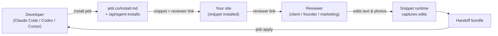

<!-- HERO BANNER (placeholder until designer assets land in .github/assets/) -->
<pre align="center">
╔══════════════════════════════════════════════════════╗
║       ██╗ ███████╗ ████████╗ ████████╗ ██╗           ║
║              J  E  T  T  I     v0.4 · skill          ║
║      website reviews for agent workflows             ║
║                                /'^^^\  .             ║
║                               ( o.o ) /              ║
╚══════════════════════════════════════════════════════╝
</pre>

<p align="center">
  <strong>Website reviews for agent workflows.</strong><br>
  Tell your AI agent to install Jetti. Send the link to your client. Get back changes your agent can apply.
</p>

<p align="center">
  <a href="https://rossres.github.io/jetti/"></a>
  <a href="https://github.com/rossres/jetti/releases/latest"></a>
  <a href="https://github.com/rossres/jetti/actions/workflows/ci.yml"></a>
  <a href="LICENSE"></a>
  
</p>

<pre align="center">
you ▸ ~/your-repo $ install jetti

  ┌─ status ─────────────────────────────────────────────┐
  │  detecting framework ✓ Vite React app                │
  │  patching head       ✓ index.html                    │
  │  verification        · run app/build next            │
  │  reviewer link       ↗ jetti.co/#/r/rev_demo         │
  └──────────────────────────────────────────────────────┘
</pre>

---

## Quickstart — with an AI agent

Open your project in Claude Code, Codex, or Cursor and paste:

```
install jetti from https://jetti.co/install.md in this repo
```

Your agent reads the install contract, mints a unique review session, patches your app's entry file with the snippet, and prints back a reviewer link to share. You don't touch a CLI.

When the reviewer is done, paste:

```
apply jetti from <handoff-url>
```

Your agent stages the changes on a branch and (if `gh` is available) opens a draft PR.

<details>
<summary><strong>Quickstart — without an agent</strong> (manual <code>curl</code> path)</summary>

If you'd rather drive it yourself:

```bash
# 1. Mint an install session and get a snippet + reviewer link.
curl -X POST https://jetti.co/api/agent-installs \
  -H 'content-type: application/json' \
  -d '{
    "targetUrl": "https://your-site.example.com",
    "sessionName": "Homepage review",
    "creatorEmail": "you@example.com"
  }'

# 2. Paste the returned snippet into your <head>.
# 3. Share the reviewer link.
# 4. When the handoff is ready, run:
npx jetti apply <handoff-url>
```

A standalone `npx @jetti/install` is on the roadmap; today the install runs through your agent or the API.

</details>

## The two CLIs

Jetti is two small CLIs around one server:

| CLI | What it does | Source |
|---|---|---|
| `scripts/jetti-install.mjs` | Mints a review session and patches your entry file with the snippet. Today: read this script. Soon: `npx @jetti/install`. | [`scripts/jetti-install.mjs`](./scripts/jetti-install.mjs) |
| `npx jetti apply <url>` | Takes a reviewer's handoff bundle, stages the changes on a branch, optionally opens a draft PR. | Published to npm; canonical source in the Jetti app monorepo |

## How it works



1. Developer asks their agent to install Jetti.
2. Agent reads `/install.md`, calls `POST /api/agent-installs`, patches the entry file, returns the reviewer link.
3. Reviewer opens the link, edits live on the site (text, photos, comments), and submits.
4. Developer runs `npx jetti apply <handoff-url>`. Their agent reviews the staged branch and merges.

The full install contract is published at [`jetti.co/install.md`](https://jetti.co/install.md) and the manifest at [`jetti.co/.well-known/jetti-install.json`](https://jetti.co/.well-known/jetti-install.json).

## Framework support

| Framework | Install detection | Notes |
|---|---|---|
| Plain HTML / static | ✅ | Patches `index.html` `<head>` |
| Vite + React | ✅ | Patches `index.html` |
| Next.js (app + pages router) | 🔜 [#3](https://github.com/rossres/jetti/issues/3) | Manual snippet paste works today |
| Webflow / custom code | 🔜 [#4](https://github.com/rossres/jetti/issues/4) | Manual snippet paste works today |
| Shopify themes | 🔜 [#5](https://github.com/rossres/jetti/issues/5) | Manual snippet paste works today |
| GTM | 🔜 | Manual snippet paste works today |

A framework adapter is one of the highest-leverage contributions today — pick up [a pinned issue](https://github.com/rossres/jetti/issues?q=is%3Aopen+is%3Aissue+label%3Aframework-adapter) and see [CONTRIBUTING.md](./CONTRIBUTING.md).

## Privacy and boundaries

Jetti is built on a few hard rules:

- **The snippet only runs on sites the developer installs it on.** It does not load third-party authenticated pages, bypass paywalls, or evade anti-bot controls.
- **Reviewers' edits stay in the handoff bundle.** They are not used to train models, sold, or shared with third parties.
- **The snippet is removable.** Deleting the `<script data-jetti-session>` tag fully uninstalls it.
- **Reviewers are always free.** Plan limits affect developer-side features only.

PRs that touch loading, proxying, capturing, recording, replaying, screenshotting, or exporting third-party site content will be reviewed against these boundaries.

## Repository layout

This repo is the **public face of Jetti**: docs, the install CLI, and the developer landing page at [`rossres.github.io/jetti/`](https://rossres.github.io/jetti/). The hosted Jetti server (the React app, snippet runtime, owner monitor, and apply CLI source) lives in a separate app monorepo and is operated at [`jetti.co`](https://jetti.co).

If you're looking to **install Jetti**, you're in the right place — start with the agent quickstart above.

If you're looking to **self-host Jetti**, that requires the app monorepo. Reach out via [SECURITY.md](./SECURITY.md) contact.

## Contributing

PRs welcome — see [CONTRIBUTING.md](./CONTRIBUTING.md). The biggest unlocks today are framework adapters for the install CLI (Next.js, Webflow, Shopify, GTM).

For security issues, see [SECURITY.md](./SECURITY.md). Please don't file public issues for vulnerabilities.

## License

[MIT](./LICENSE) © Ross Resnick.
