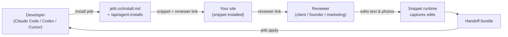

<!-- HERO BANNER (placeholder until designer assets land in .github/assets/) -->
<pre align="center">
╔══════════════════════════════════════════════════════╗
║       ██╗ ███████╗ ████████╗ ████████╗ ██╗           ║
║              J  E  T  T  I     v0.4 · skill          ║
║      website reviews for agent workflows             ║
║                                /'^^^\  .             ║
║                               ( o.o ) /              ║
╚══════════════════════════════════════════════════════╝
</pre>

<p align="center">
  <strong>Website reviews for agent workflows.</strong><br>
  Tell your AI agent to install Jetti. Send the link to your client. Get back changes your agent can apply.
</p>

<p align="center">
  <a href="https://rossres.github.io/jetti/"></a>
  <a href="https://github.com/rossres/jetti/releases/latest"></a>
  <a href="https://github.com/rossres/jetti/actions/workflows/ci.yml"></a>
  <a href="LICENSE"></a>
  
</p>

<pre align="center">
you ▸ ~/your-repo $ install jetti

  ┌─ status ─────────────────────────────────────────────┐
  │  detecting framework ✓ Vite React app                │
  │  patching head       ✓ index.html                    │
  │  verification        · run app/build next            │
  │  reviewer link       ↗ jetti.co/#/r/rev_demo         │
  └──────────────────────────────────────────────────────┘
</pre>

---

## Quickstart — with an AI agent

Open your project in Claude Code, Codex, or Cursor and paste:

```
install jetti from https://jetti.co/install.md in this repo
```

Your agent reads the install contract, mints a unique review session, patches your app's entry file with the snippet, and prints back a reviewer link to share. You don't touch a CLI.

When the reviewer is done, paste:

```
apply jetti from <handoff-url>
```

Your agent stages the changes on a branch and (if `gh` is available) opens a draft PR.

<details>
<summary><strong>Quickstart — without an agent</strong> (manual <code>curl</code> path)</summary>

If you'd rather drive it yourself:

```bash
# 1. Mint an install session and get a snippet + reviewer link.
curl -X POST https://jetti.co/api/agent-installs \
  -H 'content-type: application/json' \
  -d '{
    "targetUrl": "https://your-site.example.com",
    "sessionName": "Homepage review",
    "creatorEmail": "you@example.com"
  }'

# 2. Paste the returned snippet into your <head>.
# 3. Share the reviewer link.
# 4. When the handoff is ready, run:
npx jetti apply <handoff-url>
```

A standalone `npx @jetti/install` is on the roadmap; today the install runs through your agent or the API.

</details>

## What it looks like in 60 seconds

A real session looks like this:

```
0:00  Dev (in Claude Code) ▸ install jetti from https://jetti.co/install.md
0:15  Agent fetches /install.md, mints a session, patches index.html
0:18  Agent prints reviewer link: jetti.co/#/r/rev_abc123
0:20  Dev pastes link in Slack: "@megan, take a pass at the homepage copy"

—— meanwhile ——

0:00  Megan opens the link, accepts the consent banner
0:05  Megan sees the live site with Jetti chrome at the top
0:30  Megan clicks any visible text → inline editor → types the change
1:30  Megan replaces a hero photo by dropping a file onto the 
2:00  Megan pins a comment on the pricing card
3:00  Megan clicks "Send to developer"

—— back in Claude Code ——

3:30  Dev ▸ apply jetti from <handoff-url-from-megan>
3:45  Agent stages changes on a branch, opens a draft PR, prints the diff
4:00  Dev reviews and merges
```

No screen recording. No "the third paragraph, second sentence, change 'we' to 'you'" translation. The diff is what the reviewer typed.

## Two review modes

Jetti ships with two paths, picked automatically by the reviewability gate:

- **Quick text review** — for public, mostly-static pages (marketing sites, docs, landing pages). No install. Jetti loads the page server-side; the reviewer edits in a Jetti-hosted shell.
- **Full site review** — for SPAs, dynamic pages, staging sites, or anything that needs photo replacement. Requires the snippet (one `<script>` tag) and is removable in seconds.

The reviewer doesn't see the mode — they just open the link. Mode selection happens behind the scenes based on what your site supports.

## What reviewers can do

Without an account, reviewers can:

- **Edit visible text** — click any rendered string, type the change, press enter
- **Replace photos** — drag a new file onto any ``
- **Leave comments** — pin notes to specific elements
- **Ask Vibe Assist** for a copy rewrite — three free uses per session
- **Send the review** to the developer when they're done

What reviewers can't do:

- Edit hidden, server-rendered, or behind-auth content the page doesn't already render
- Inspect or modify scripts, data, or anything not visible on the page
- Re-publish, share, or export the original site's content

## The two CLIs

Jetti is two small CLIs around one server:

| CLI | What it does | Source |
|---|---|---|
| `scripts/jetti-install.mjs` | Mints a review session and patches your entry file with the snippet. Today: read this script. Soon: `npx @jetti/install`. | [`scripts/jetti-install.mjs`](./scripts/jetti-install.mjs) |
| `npx jetti apply <url>` | Takes a reviewer's handoff bundle, stages the changes on a branch, optionally opens a draft PR. | Published to npm; canonical source in the Jetti app monorepo |

## How it works



1. Developer asks their agent to install Jetti.
2. Agent reads `/install.md`, calls `POST /api/agent-installs`, patches the entry file, returns the reviewer link.
3. Reviewer opens the link, edits live on the site (text, photos, comments), and submits.
4. Developer runs `npx jetti apply <handoff-url>`. Their agent reviews the staged branch and merges.

The full install contract is published at [`jetti.co/install.md`](https://jetti.co/install.md) and the manifest at [`jetti.co/.well-known/jetti-install.json`](https://jetti.co/.well-known/jetti-install.json).

## Framework support

| Framework | Install detection | Notes |
|---|---|---|
| Plain HTML / static | ✅ | Patches `index.html` `<head>` |
| Vite + React | ✅ | Patches `index.html` |
| Next.js (app + pages router) | 🔜 [#3](https://github.com/rossres/jetti/issues/3) | Manual snippet paste works today |
| Webflow / custom code | 🔜 [#4](https://github.com/rossres/jetti/issues/4) | Manual snippet paste works today |
| Shopify themes | 🔜 [#5](https://github.com/rossres/jetti/issues/5) | Manual snippet paste works today |
| GTM | 🔜 | Manual snippet paste works today |

A framework adapter is one of the highest-leverage contributions today — pick up [a pinned issue](https://github.com/rossres/jetti/issues?q=is%3Aopen+is%3Aissue+label%3Aframework-adapter) and see [CONTRIBUTING.md](./CONTRIBUTING.md).

## Compared to Loom / Figma comments / GitHub issues

|  | Loom | Figma comments | GitHub issues | **Jetti** |
|---|:---:|:---:|:---:|:---:|
| Reviewer needs an account | no | yes | yes | **no** |
| Reviewer edits the live site | no | no | no | **yes** |
| Output is structured for devs | no | partial | partial | **yes (diff)** |
| Works on the actual production HTML | yes (read) | no (mockup) | yes (read) | **yes (edit)** |
| Agent can apply the changes | no | no | no | **yes** |

If your reviewer talks in Looms, you spend 20 minutes translating "the third paragraph, second sentence, change 'we' to 'you'" into a diff. Jetti makes the diff *be* the review.

## FAQ

<details>
<summary><strong>How is this different from Figma comments?</strong></summary>

Figma comments live on a mockup. Jetti edits live on the rendered site — what the reviewer sees is what's in production, including the typos that snuck in after the design was approved. Jetti's output is a diff your agent can apply; Figma's output is a thread your developer translates by hand.

</details>

<details>
<summary><strong>Does Jetti work on sites behind auth or paywalls?</strong></summary>

The snippet path works on whatever site you install it on, including authenticated apps — the reviewer hits the same auth flow you do. The proxy / quick-text path explicitly does not bypass logins, paywalls, anti-bot measures, or any other access control. See [SECURITY.md](./SECURITY.md) for the full list of stop-and-ask conditions.

</details>

<details>
<summary><strong>Does the snippet modify my site?</strong></summary>

No. The snippet adds Jetti chrome and listens for reviewer edits when an active session is live. It does not modify the DOM otherwise, write to your storage, or call your APIs. Deleting the `<script data-jetti-session>` tag fully uninstalls it.

</details>

<details>
<summary><strong>What gets sent to Jetti's servers?</strong></summary>

When a reviewer is editing: the text/photo/comment edits they make, the URL they're on, and a heartbeat for presence. When no session is active: nothing. The snippet does not record keystrokes, screenshots, network payloads, cookies, or content the reviewer doesn't intentionally edit. See [`/privacy`](https://jetti.co/privacy) and [`/ai-data`](https://jetti.co/ai-data) for the full data inventory.

</details>

<details>
<summary><strong>What does it cost?</strong></summary>

Reviewers are always free — they don't sign up, don't see plans, don't get rate-limited. Today, developers can run their first review for free; paid plans for repeat snippet-backed handoffs are coming. Current state and policy live at [jetti.co/pricing](https://jetti.co/pricing).

</details>

<details>
<summary><strong>Is what I send to "Vibe Assist" used to train models?</strong></summary>

No. Vibe Assist sends the selected text to Anthropic for the single rewrite request and is not retained or used for training. See [`/ai-data`](https://jetti.co/ai-data).

</details>

<details>
<summary><strong>Can I self-host?</strong></summary>

Not yet. The hosted server (snippet runtime, owner monitor, apply CLI source) lives in a separate app monorepo. Self-host is a long-term goal but not a v1 promise. If you have a specific need, [open a Discussion](https://github.com/rossres/jetti/discussions).

</details>

<details>
<summary><strong>What happens if I uninstall mid-review?</strong></summary>

The reviewer's link stops working, but the edits they've already submitted are preserved in the handoff bundle. You can `apply jetti` from any handoff URL whether or not the snippet is currently installed.

</details>

## Privacy and boundaries

Jetti is built on a few hard rules:

- **The snippet only runs on sites the developer installs it on.** It does not load third-party authenticated pages, bypass paywalls, or evade anti-bot controls.
- **Reviewers' edits stay in the handoff bundle.** They are not used to train models, sold, or shared with third parties.
- **The snippet is removable.** Deleting the `<script data-jetti-session>` tag fully uninstalls it.
- **Reviewers are always free.** Plan limits affect developer-side features only.

PRs that touch loading, proxying, capturing, recording, replaying, screenshotting, or exporting third-party site content will be reviewed against these boundaries. Stop-and-ask conditions for changes that could weaken them are documented in [SECURITY.md](./SECURITY.md).

## The install contract

`install jetti from https://jetti.co/install.md` works because of three public surfaces:

1. **[`jetti.co/install.md`](https://jetti.co/install.md)** — agent-readable install instructions. Tells the agent which entry file to patch, the snippet shape, and how to verify.
2. **[`jetti.co/.well-known/jetti-install.json`](https://jetti.co/.well-known/jetti-install.json)** — machine-readable manifest with the snippet `src`, supported framework adapters, and the install-session endpoint shape.
3. **`POST jetti.co/api/agent-installs`** — mints a session, returns the snippet `<script>` tag (with a session-scoped token) and the reviewer URL.

The CLI in [`scripts/jetti-install.mjs`](./scripts/jetti-install.mjs) is one consumer of that contract. Any agent that follows the contract can install Jetti — Claude Code, Codex, Cursor, a custom GitHub Action, your own script.

This is the same pattern as `llms.txt` and `robots.txt`, but for install: **a stable URL + a manifest + a CLI is the agent's API**.

## Repository layout

This repo is the **public face of Jetti**: docs, the install CLI, and the developer landing page at [`rossres.github.io/jetti/`](https://rossres.github.io/jetti/). The hosted Jetti server (the React app, snippet runtime, owner monitor, and apply CLI source) lives in a separate app monorepo and is operated at [`jetti.co`](https://jetti.co).

If you're looking to **install Jetti**, you're in the right place — start with the agent quickstart above.

If you're looking to **self-host Jetti**, that requires the app monorepo. Reach out via [SECURITY.md](./SECURITY.md) contact.

## Roadmap

Pre-1.0, ordered by leverage:

1. **Framework auto-detect** for Next.js ([#3](https://github.com/rossres/jetti/issues/3)), Webflow ([#4](https://github.com/rossres/jetti/issues/4)), Shopify ([#5](https://github.com/rossres/jetti/issues/5)), and GTM. The contract supports any framework — the install CLI just needs to recognize and patch them.
2. **Standalone `npx @jetti/install`** package, so the install path doesn't depend on cloning this repo.
3. **Browser-tested adapter coverage** — every framework adapter ships with a fixture that proves install + reviewer flow + apply on a real page (SPA, SSR, CSP, ad-blocker conditions).
4. **Snippet reliability matrix** — published proof of text/photo/comment capture across the conditions above.

Beyond v1: self-hostable server, custom branding for agencies, bigger reviewer toolkit (suggested rewrites, per-element comments), org-level audit log.

Anything you'd add? [Open a Discussion](https://github.com/rossres/jetti/discussions).

## Community

- [GitHub Discussions](https://github.com/rossres/jetti/discussions) — questions, "does this work on X?", framework-adapter ideas.
- [Issues](https://github.com/rossres/jetti/issues) — bugs, feature requests; framework adapters are labeled [`good first issue`](https://github.com/rossres/jetti/issues?q=is%3Aopen+is%3Aissue+label%3A%22good+first+issue%22).
- [SECURITY.md](./SECURITY.md) — security disclosures (please don't file public issues for vulnerabilities).
- [jetti.co](https://jetti.co) — the customer-facing site. Reviewer flow, pricing, legal pages.
- [rossres.github.io/jetti](https://rossres.github.io/jetti/) — developer landing page.

## Contributing

PRs welcome — see [CONTRIBUTING.md](./CONTRIBUTING.md). The biggest unlocks today are framework adapters for the install CLI (Next.js, Webflow, Shopify, GTM).

For security issues, see [SECURITY.md](./SECURITY.md). Please don't file public issues for vulnerabilities.

## License

[MIT](./LICENSE) © Ross Resnick.
