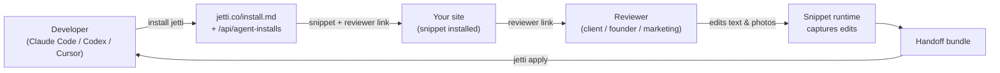

<!-- HERO BANNER (placeholder until designer assets land in .github/assets/) -->
<pre align="center">
╔══════════════════════════════════════════════════════╗
║       ██╗ ███████╗ ████████╗ ████████╗ ██╗           ║
║              J  E  T  T  I     v0.4 · skill          ║
║      website reviews for agent workflows             ║
║                                /'^^^\  .             ║
║                               ( o.o ) /              ║
╚══════════════════════════════════════════════════════╝
</pre>

<p align="center">
  <strong>Website reviews for agent workflows.</strong><br>
  Tell your AI agent to install Jetti. Send the link to your client. Get back changes your agent can apply.
</p>

<p align="center">
  <a href="https://rossres.github.io/jetti/"></a>
  <a href="https://github.com/rossres/jetti/actions/workflows/ci.yml"></a>
  <a href="LICENSE"></a>
  <a href="https://jetti.co"></a>
  
  
</p>

<pre align="center">
you ▸ ~/your-repo $ install jetti

  ┌─ status ─────────────────────────────────────────────┐
  │  detecting framework ✓ Vite React app                │
  │  patching head       ✓ index.html                    │
  │  verification        · run app/build next            │
  │  reviewer link       ↗ jetti.co/#/r/rev_demo         │
  └──────────────────────────────────────────────────────┘
</pre>

---

## Table of contents

- [What Jetti does](#what-jetti-does)
- [Quickstart — with an AI agent](#quickstart--with-an-ai-agent)
- [Quickstart — without an agent](#quickstart--without-an-agent)
- [Why Jetti](#why-jetti)
- [Use cases](#use-cases)
- [The two CLIs](#the-two-clis)
- [How it works](#how-it-works)
- [Framework support](#framework-support)
- [Examples](#examples)
- [Architecture](#architecture)
- [Privacy and boundaries](#privacy-and-boundaries)
- [FAQ](#faq)
- [Roadmap](#roadmap)
- [Repository layout](#repository-layout)
- [Contributing](#contributing)
- [Community and support](#community-and-support)
- [Acknowledgments](#acknowledgments)
- [License](#license)

## What Jetti does

Jetti is a **terminal-native website-review tool for developers who use AI agents**. The whole product is one phrase you paste into Claude Code, Codex, or Cursor:

```
install jetti from https://jetti.co/install.md
```

Your agent reads the install contract, mints a unique review session, patches your project's entry file with a small JS snippet, and prints back a reviewer link. You send that link to your client, founder, or marketing lead. They edit text and photos directly on your live site. You run `apply jetti from <handoff-url>`, your agent stages the changes on a branch, and you ship.

No screen-recording. No Loom-to-Linear-to-Jira-to-PR translation. The reviewer changes the words and photos they mean; the developer gets a structured handoff their agent can apply.

## Quickstart — with an AI agent

Open your project in **Claude Code, Codex, or Cursor** and paste:

```
install jetti from https://jetti.co/install.md in this repo
```

Your agent will:

1. Fetch the install contract at [`jetti.co/install.md`](https://jetti.co/install.md)
2. POST to [`jetti.co/api/agent-installs`](https://jetti.co/api/agent-installs) to mint a unique session
3. Detect your framework (Vite/React or plain HTML today; more coming)
4. Patch your entry file's `<head>` with the snippet
5. Print a reviewer link

When the reviewer's done and you have a handoff URL, paste:

```
apply jetti from <handoff-url>
```

Your agent stages the reviewer's changes on a fresh branch and (if `gh` is available) opens a draft PR.

## Quickstart — without an agent

If you'd rather drive it yourself:

```bash
# 1. Mint an install session.
curl -X POST https://jetti.co/api/agent-installs \
  -H 'content-type: application/json' \
  -d '{
    "targetUrl": "https://your-site.example.com",
    "sessionName": "Homepage review",
    "creatorEmail": "you@example.com"
  }'

# 2. Paste the returned snippet into your <head>.
# 3. Share the reviewer link.
# 4. When the handoff is ready, run:
npx jetti apply <handoff-url>
```

For framework-specific instructions (Next.js, Webflow, Shopify, GTM), see [`docs/install-recipes.md`](./docs/install-recipes.md).

## Why Jetti

The dev-to-stakeholder review loop is broken in three different ways. Jetti's design choices come from picking specific fights with each:

| Tool category | What it gets right | Where it falls down | What Jetti does instead |
|---|---|---|---|
| Loom / Tella videos | Stakeholder voice + emotion | Devs have to *re-translate* the feedback into edits | Stakeholder edits the words/photos directly; dev gets the actual change |
| BugHerd / Marker.io | Pin comments to elements | Comments aren't edits; still a translation step | Inline editing with photo swap; comments are secondary |
| Figma comments | Live collaboration | Lives in design land, not code; reviewer needs an account | Lives on the actual site; reviewer needs zero accounts |
| Screenshot + Slack | Fast | No structure; no provenance; gets lost | Structured handoff bundle, replayable, attached to a session |

Jetti is **not** a generic feedback tool with AI sprinkled on. The agent loop — install via agent, apply via agent — is the product.

## Use cases

Three concrete flows where Jetti pays for itself:

### 1. Agency or freelancer landing-page review

You shipped a landing page for a client. The client says "the hero copy isn't quite right and the second photo should be different." Instead of three rounds of Slack screenshots:

- **Without Jetti:** client sends Loom describing changes, you re-type the copy, you find/swap the photo, you push, they review again.
- **With Jetti:** `install jetti`, send the link, the client edits the copy in-place and uploads the new photo, you run `apply jetti`, your agent opens a PR with both edits in one diff.

### 2. Founder-led copy editing on a product site

You're a solo founder iterating on the marketing site between feature releases. You want to test five hero variants without filing tickets to yourself.

- `install jetti` once on `staging.yoursite.com`
- Edit headlines + subhead + CTA copy directly in the browser whenever something feels off
- `apply jetti` ships the edits to a branch; you merge what you like

### 3. Stakeholder photo swaps

Marketing wants to swap five product photos for the launch. Your devs would otherwise do this manually from a Notion doc.

- Send marketing a Jetti reviewer link
- They drag-drop the new photos onto the site in the live preview
- The handoff bundle includes the new image files + their target placements; your agent applies them

## The two CLIs

Jetti is two small CLIs around one server:

| CLI | What it does | Source |
|---|---|---|
| `scripts/jetti-install.mjs` | Mints a review session and patches your entry file with the snippet. Today: read this script directly. Soon: `npx @jetti/cli install`. | [`scripts/jetti-install.mjs`](./scripts/jetti-install.mjs) |
| `npx jetti apply <url>` | Takes a reviewer's handoff bundle, stages the changes on a branch, optionally opens a draft PR. | Published to npm; canonical source in the Jetti app monorepo |

## How it works



1. Developer asks their agent to install Jetti.
2. Agent reads `/install.md`, calls `POST /api/agent-installs`, patches the entry file, returns the reviewer link.
3. Reviewer opens the link, edits live on the site (text, photos, comments), and submits.
4. Developer runs `npx jetti apply <handoff-url>`. Their agent reviews the staged branch and merges.

For the deep system overview — endpoints, snippet runtime, capture format, handoff schema — see [`docs/architecture.md`](./docs/architecture.md).

## Framework support

| Framework | Install detection | Notes |
|---|---|---|
| Plain HTML / static | ✅ | Patches `index.html` `<head>` |
| Vite + React | ✅ | Patches `index.html` |
| Next.js (app router) | 🔜 | Roadmap — see [issue tracker](https://github.com/rossres/jetti/issues?q=is%3Aissue+label%3Aframework-adapter) |
| Next.js (pages router) | 🔜 | Roadmap |
| Astro | 🔜 | Roadmap |
| Webflow / custom code | 🔜 | Manual snippet paste works today — see [`docs/install-recipes.md`](./docs/install-recipes.md) |
| Shopify themes | 🔜 | Manual snippet paste — see recipes |
| GTM | 🔜 | Manual snippet paste — see recipes |

A framework adapter is one of the highest-leverage contributions. See [CONTRIBUTING.md](./CONTRIBUTING.md) and the [`framework-adapter` issue label](https://github.com/rossres/jetti/issues?q=is%3Aissue+label%3Aframework-adapter).

## Examples

Working sample projects in [`examples/`](./examples/):

- [`examples/vite-react/`](./examples/vite-react/) — Vite + React app showing where the snippet auto-installs.
- [`examples/plain-html/`](./examples/plain-html/) — minimal static site.

Each example has a README walking through the install flow on that stack.

For framework-specific copy-paste recipes, see [`docs/install-recipes.md`](./docs/install-recipes.md).

## Architecture

The full system overview lives in [`docs/architecture.md`](./docs/architecture.md). Quick map:

- **Install contract** — `jetti.co/install.md` (agent-readable Markdown), `jetti.co/.well-known/jetti-install.json` (machine-readable manifest), `POST jetti.co/api/agent-installs` (session minting endpoint).
- **Snippet runtime** — single-origin JS bundle served from `jetti.co/snippet.js`. Activates on the developer's site for the reviewer's session only.
- **Reviewer experience** — in-browser inline editing for text and photos, plus Caveat-styled comment annotations.
- **Handoff bundle** — signed, short-lived JSON bundle with structured edits (text patches, photo swaps, comments) the apply CLI consumes.
- **Apply CLI** — `npx jetti apply <handoff-url>` stages changes on a branch and opens a draft PR.

## Privacy and boundaries

Jetti is built on a few hard rules:

- **The snippet only runs on sites the developer installs it on.** It does not load third-party authenticated pages, bypass paywalls, or evade anti-bot controls.
- **Reviewers' edits stay in the handoff bundle.** Not used to train models, sold, or shared with third parties.
- **The snippet is fully removable.** Deleting the `<script data-jetti-session>` tag uninstalls it.
- **Reviewers are always free.** Plan limits affect developer-side features only.
- **No telemetry on the install CLI** beyond the session mint call to `/api/agent-installs`.

PRs that touch loading, proxying, capturing, recording, replaying, screenshotting, or exporting third-party site content will be reviewed against these boundaries.

## FAQ

<details>
<summary><strong>Does Jetti work with sites that need login?</strong></summary>

Reviewer-facing — yes. The reviewer opens the link in their own browser; Jetti loads on top of the site as the reviewer sees it. If the reviewer is authenticated, they see authenticated content. Jetti does not handle the authentication itself.

Install-side — Jetti patches files in your repo, so it works regardless of whether the *deployed* site requires login.
</details>

<details>
<summary><strong>What does the reviewer see — a different version of my site?</strong></summary>

No. The reviewer sees your real site. Jetti adds an inline editor chrome (a small bottom bar and edit affordances on hover) but does not clone or proxy the page. They're editing the actual rendered DOM in their browser; their edits are captured and sent back as a structured handoff.
</details>

<details>
<summary><strong>How is this different from Loom or BugHerd?</strong></summary>

Loom captures the reviewer's voice describing changes; you still have to translate. BugHerd attaches comments to elements; comments are not edits. Jetti captures *the actual edits* — the new copy, the new photo — and hands them to your agent in a format it can apply.
</details>

<details>
<summary><strong>Can I self-host Jetti?</strong></summary>

The install CLI in this repo is fully usable on its own — but it depends on a running Jetti server (the React app, snippet runtime, owner monitor, and apply CLI server endpoint). The hosted instance at `jetti.co` is what most users want. Self-hosting requires the internal app monorepo; reach out via [SECURITY.md](./SECURITY.md) contact for now.
</details>

<details>
<summary><strong>What frameworks does the install CLI auto-detect?</strong></summary>

Today: plain HTML / static and Vite + React (it patches `index.html`). Next.js (app router and pages router), Astro, Webflow, Shopify, and GTM are roadmap — see [`docs/install-recipes.md`](./docs/install-recipes.md) for manual instructions and the [`framework-adapter` issues](https://github.com/rossres/jetti/issues?q=is%3Aissue+label%3Aframework-adapter) to contribute.
</details>

<details>
<summary><strong>Is the reviewer's data sent to AI?</strong></summary>

The reviewer's edits are stored as part of the handoff bundle so the developer's agent can apply them. They are not used to train Jetti's models, not shared with third-party AI services, and the bundle is short-lived (signed, expiring URL).
</details>

<details>
<summary><strong>What if I don't use an AI agent?</strong></summary>

Use the manual quickstart above. Mint a session via curl, paste the snippet, share the link, run `npx jetti apply` when the handoff is ready. The agent path is the *intended* one; the manual path always works.
</details>

<details>
<summary><strong>How do I uninstall Jetti?</strong></summary>

Delete the `<script data-jetti-session=...>` tag from your `<head>`. That's it. The reviewer link stops working; no client-side state remains on visitors' browsers.
</details>

## Roadmap

The full roadmap with milestones lives in [ROADMAP.md](./ROADMAP.md). High-level priorities:

- **Framework adapters** — Next.js (both routers), Astro, then Webflow / Shopify / GTM helpers.
- **`npx @jetti/cli` package** — publish the install CLI as a standalone npm package.
- **Verification handshake** — post-install, the CLI waits for a real snippet heartbeat and reports verified state.
- **Self-host docs** — clearer path for teams who want to run their own Jetti server.

## Repository layout

This repo is the **public face of Jetti**: docs, the install CLI, examples, and the developer landing page at [`rossres.github.io/jetti/`](https://rossres.github.io/jetti/). The hosted Jetti server (the React app, snippet runtime, owner monitor, and apply CLI source) lives in a separate app monorepo and is operated at [`jetti.co`](https://jetti.co).

```
jetti/
├── README.md                     ← you are here
├── ROADMAP.md                    ← framework adapters + milestones
├── CONTRIBUTING.md               ← how to contribute
├── CODE_OF_CONDUCT.md            ← Contributor Covenant 2.1
├── SECURITY.md                   ← vulnerability disclosure
├── SUPPORT.md                    ← where to ask for help
├── AGENTS.md                     ← guidance for AI agents working on this repo
├── package.json                  ← npm package metadata (publishes as @jetti/cli)
├── .github/
│   ├── workflows/ci.yml          ← node --check + required-files
│   ├── ISSUE_TEMPLATE/           ← bug, feature, framework adapter
│   ├── PULL_REQUEST_TEMPLATE.md
│   └── dependabot.yml
├── docs/
│   ├── index.html                ← dev landing page (GitHub Pages)
│   ├── architecture.md           ← system overview
│   └── install-recipes.md        ← framework-specific manual install
├── examples/
│   ├── vite-react/               ← Vite + React sample
│   └── plain-html/               ← static-site sample
└── scripts/
    └── jetti-install.mjs         ← the install CLI
```

## Contributing

PRs welcome — see [CONTRIBUTING.md](./CONTRIBUTING.md). Highest-leverage starts:

- **Framework adapters** — pick one of the [`framework-adapter` issues](https://github.com/rossres/jetti/issues?q=is%3Aissue+label%3Aframework-adapter) and add detection + patch logic to `scripts/jetti-install.mjs`.
- **Install recipes** — add manual-install instructions for a framework to [`docs/install-recipes.md`](./docs/install-recipes.md).
- **Examples** — add a working sample to [`examples/`](./examples/) showing the install flow on a stack you use.
- **Dev landing polish** — `docs/index.html` is self-contained HTML; visual / accessibility / copy improvements welcome.

For security issues, see [SECURITY.md](./SECURITY.md).

## Community and support

- 💬 **Questions, ideas, "is this the right approach?"** → [GitHub Discussions](https://github.com/rossres/jetti/discussions)
- 🐛 **Bugs** → [open an issue](https://github.com/rossres/jetti/issues/new/choose)
- ✨ **Feature ideas** → discussions first, then [feature request](https://github.com/rossres/jetti/issues/new?template=feature_request.yml)
- 🔒 **Security** → email per [SECURITY.md](./SECURITY.md)
- 🤝 **Code of conduct** → [CODE_OF_CONDUCT.md](./CODE_OF_CONDUCT.md)

For more support resources, see [SUPPORT.md](./SUPPORT.md).

## Acknowledgments

Jetti's terminal-installer aesthetic owes a lot to [BMAD-METHOD](https://github.com/bmad-code-org/BMAD-METHOD) — the first project to treat the installer itself as the hero artifact.

The "single command above the fold" landing-page pattern was lifted from [Bun](https://bun.sh) and [react.email](https://react.email).

## License

[MIT](./LICENSE) © Ross Resnick.

<p align="center">
  <a href="https://star-history.com/#rossres/jetti&Date">
    
  </a>
</p>
