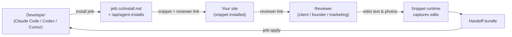

<!-- HERO BANNER (placeholder until designer assets land in .github/assets/) -->
<pre align="center">
╔══════════════════════════════════════════════════════╗
║       ██╗ ███████╗ ████████╗ ████████╗ ██╗           ║
║              J  E  T  T  I     v0.4 · skill          ║
║      website reviews for agent workflows             ║
║                                /'^^^\  .             ║
║                               ( o.o ) /              ║
╚══════════════════════════════════════════════════════╝
</pre>

<p align="center">
  <strong>Website reviews for agent workflows.</strong><br>
  Tell your AI agent to install Jetti. Send the link to your client. Get back changes your agent can apply.
</p>

<p align="center">
  <a href="https://rossres.github.io/jetti/"></a>
  <a href="https://github.com/rossres/jetti/releases/latest"></a>
  <a href="https://github.com/rossres/jetti/actions/workflows/ci.yml"></a>
  <a href="LICENSE"></a>
  
</p>

<pre align="center">
you ▸ ~/your-repo $ install jetti

  ┌─ status ─────────────────────────────────────────────┐
  │  detecting framework ✓ Vite React app                │
  │  patching head       ✓ index.html                    │
  │  verification        · run app/build next            │
  │  reviewer link       ↗ jetti.co/#/r/rev_demo         │
  └──────────────────────────────────────────────────────┘
</pre>

---

## Table of contents

- [What Jetti does](#what-jetti-does)
- [Quickstart — with an AI agent](#quickstart--with-an-ai-agent)
- [What it looks like in 60 seconds](#what-it-looks-like-in-60-seconds)
- [Two review modes](#two-review-modes)
- [What reviewers can do](#what-reviewers-can-do)
- [Use cases](#use-cases)
- [Compared to Loom / Figma comments / GitHub issues](#compared-to-loom--figma-comments--github-issues)
- [The two CLIs](#the-two-clis)
- [How it works](#how-it-works)
- [Framework support](#framework-support)
- [Examples](#examples)
- [The install contract](#the-install-contract)
- [Architecture](#architecture)
- [Privacy and boundaries](#privacy-and-boundaries)
- [FAQ](#faq)
- [Roadmap](#roadmap)
- [Repository layout](#repository-layout)
- [Contributing](#contributing)
- [Community and support](#community-and-support)
- [Acknowledgments](#acknowledgments)
- [License](#license)

## What Jetti does

Jetti is a **terminal-native website-review tool for developers who use AI agents**. The whole product is one phrase you paste into Claude Code, Codex, or Cursor:

```
install jetti from https://jetti.co/install.md
```

Your agent reads the install contract, mints a unique review session, patches your project's entry file with a small JS snippet, and prints back a reviewer link. You send that link to your client, founder, or marketing lead. They edit text and photos directly on your live site. You run `apply jetti from <handoff-url>`, your agent stages the changes on a branch, and you ship.

No screen-recording. No Loom-to-Linear-to-Jira-to-PR translation. The reviewer changes the words and photos they mean; the developer gets a structured handoff their agent can apply.

## Quickstart — with an AI agent

Open your project in **Claude Code, Codex, or Cursor** and paste:

```
install jetti from https://jetti.co/install.md in this repo
```

Your agent will:

1. Fetch the install contract at [`jetti.co/install.md`](https://jetti.co/install.md)
2. POST to [`jetti.co/api/agent-installs`](https://jetti.co/api/agent-installs) to mint a unique session
3. Detect your framework — the CLI auto-patches Vite/React and plain HTML; for Next.js, Astro, and other stacks the agent follows the per-stack recipe at `jetti.co/install.md`
4. Patch your entry file's `<head>` with the snippet
5. Print a reviewer link

When the reviewer's done and you have a handoff URL, paste:

```
apply jetti from <handoff-url>
```

Your agent stages the reviewer's changes on a fresh branch and (if `gh` is available) opens a draft PR.

<details>
<summary><strong>Quickstart — without an agent</strong> (manual <code>curl</code> path)</summary>

If you'd rather drive it yourself:

```bash
# 1. Mint an install session.
curl -X POST https://jetti.co/api/agent-installs \
  -H 'content-type: application/json' \
  -d '{
    "targetUrl": "https://your-site.example.com",
    "sessionName": "Homepage review",
    "creatorEmail": "you@example.com"
  }'

# 2. Paste the returned snippet into your <head>.
# 3. Share the reviewer link.
# 4. When the handoff is ready, run:
npx jetti apply <handoff-url>
```

For framework-specific instructions (Next.js, Webflow, Shopify, GTM), see [`docs/install-recipes.md`](./docs/install-recipes.md).

A standalone `npx @jetti/cli install` is on the roadmap; today the install runs through your agent or the API.

</details>

## What it looks like in 60 seconds

A real session looks like this:

```
0:00  Dev (in Claude Code) ▸ install jetti from https://jetti.co/install.md
0:15  Agent fetches /install.md, mints a session, patches index.html
0:18  Agent prints reviewer link: jetti.co/#/r/rev_abc123
0:20  Dev pastes link in Slack: "@megan, take a pass at the homepage copy"

—— meanwhile ——

0:00  Megan opens the link, accepts the consent banner
0:05  Megan sees the live site with Jetti chrome at the top
0:30  Megan clicks any visible text → inline editor → types the change
1:30  Megan replaces a hero photo by dropping a file onto the 
2:00  Megan pins a comment on the pricing card
3:00  Megan clicks "Send to developer"

—— back in Claude Code ——

3:30  Dev ▸ apply jetti from <handoff-url-from-megan>
3:45  Agent stages changes on a branch, opens a draft PR, prints the diff
4:00  Dev reviews and merges
```

No screen recording. No "the third paragraph, second sentence, change 'we' to 'you'" translation. The diff is what the reviewer typed.

## Two review modes

Jetti ships with two paths, picked automatically by the reviewability gate:

- **Quick text review** — for public, mostly-static pages (marketing sites, docs, landing pages). No install. Jetti loads the page server-side; the reviewer edits in a Jetti-hosted shell.
- **Full site review** — for SPAs, dynamic pages, staging sites, or anything that needs photo replacement. Requires the snippet (one `<script>` tag) and is removable in seconds.

The reviewer doesn't see the mode — they just open the link. Mode selection happens behind the scenes based on what your site supports.

## What reviewers can do

Without an account, reviewers can:

- **Edit visible text** — click any rendered string, type the change, press enter
- **Replace photos** — upload a new file for any `` (drag-drop or click-to-pick)
- **Leave comments** — pin notes to specific elements
- **Ask Vibe Assist** for a copy rewrite — three free uses per session
- **Send the review** to the developer when they're done

What reviewers can't do:

- Edit hidden, server-rendered, or behind-auth content the page doesn't already render
- Inspect or modify scripts, data, or anything not visible on the page
- Re-publish, share, or export the original site's content

## Use cases

Three concrete flows where Jetti pays for itself:

### 1. Agency or freelancer landing-page review

You shipped a landing page for a client. The client says "the hero copy isn't quite right and the second photo should be different." Instead of three rounds of Slack screenshots:

- **Without Jetti:** client sends Loom describing changes, you re-type the copy, you find/swap the photo, you push, they review again.
- **With Jetti:** `install jetti`, send the link, the client edits the copy in-place and uploads the new photo, you run `apply jetti`, your agent opens a PR with both edits in one diff.

### 2. Founder-led copy editing on a product site

You're a solo founder iterating on the marketing site between feature releases. You want to test five hero variants without filing tickets to yourself.

- `install jetti` once on `staging.yoursite.com`
- Edit headlines + subhead + CTA copy directly in the browser whenever something feels off
- `apply jetti` ships the edits to a branch; you merge what you like

### 3. Stakeholder photo swaps

Marketing wants to swap five product photos for the launch. Your devs would otherwise do this manually from a Notion doc.

- Send marketing a Jetti reviewer link
- They drag-drop the new photos onto the site in the live preview
- The handoff bundle includes the new image files + their target placements; your agent applies them

## Compared to Loom / Figma comments / GitHub issues

|  | Loom | Figma comments | GitHub issues | **Jetti** |
|---|:---:|:---:|:---:|:---:|
| Reviewer needs an account | no | yes | yes | **no** |
| Reviewer edits the live site | no | no | no | **yes** |
| Output is structured for devs | no | partial | partial | **yes (diff)** |
| Works on the actual production HTML | yes (read) | no (mockup) | yes (read) | **yes (edit)** |
| Agent can apply the changes | no | no | no | **yes** |

If your reviewer talks in Looms, you spend 20 minutes translating "the third paragraph, second sentence, change 'we' to 'you'" into a diff. Jetti makes the diff *be* the review.

## The two CLIs

Jetti is two small CLIs around one server:

| CLI | What it does | Source |
|---|---|---|
| `scripts/jetti-install.mjs` | Mints a review session and patches your entry file with the snippet. Today: read this script directly. Soon: `npx @jetti/cli install`. | [`scripts/jetti-install.mjs`](./scripts/jetti-install.mjs) |
| `npx jetti apply <url>` | Takes a reviewer's handoff bundle, stages the changes on a branch, optionally opens a draft PR. | Published to npm; canonical source in the Jetti app monorepo |

## How it works



1. Developer asks their agent to install Jetti.
2. Agent reads `/install.md`, calls `POST /api/agent-installs`, patches the entry file, returns the reviewer link.
3. Reviewer opens the link, edits live on the site (text, photos, comments), and submits.
4. Developer runs `npx jetti apply <handoff-url>`. Their agent reviews the staged branch and merges.

For the deep system overview — endpoints, snippet runtime, capture format, handoff schema — see [`docs/architecture.md`](./docs/architecture.md).

## Framework support

The Jetti snippet runs on every framework below. The install path differs depending on whether the CLI knows the stack, an agent has codebase access, or you're pasting into a site builder.

| Framework | Install path | Notes |
|---|---|---|
| Vite + React | ✅ CLI auto-patch | Patches `index.html` |
| Plain HTML / static | ✅ CLI auto-patch | Patches `index.html` `<head>` |
| Next.js (app router) | ✅ AI prompt | Recipe at [`jetti.co/install.md`](https://jetti.co/install.md) patches `app/layout.tsx`. CLI auto-detect tracked at [#3](https://github.com/rossres/jetti/issues/3). |
| Next.js (pages router) | ✅ AI prompt | Recipe at [`jetti.co/install.md`](https://jetti.co/install.md) patches `pages/_document.tsx`. CLI auto-detect tracked at [#3](https://github.com/rossres/jetti/issues/3). |
| Astro | ✅ AI prompt | Recipe at [`jetti.co/install.md`](https://jetti.co/install.md) patches the root layout `<head>`. CLI auto-detect tracked at [#9](https://github.com/rossres/jetti/issues/9). |
| Webflow / custom code | ✅ Paste | Site head field — no codebase needed. Helper tracked at [#4](https://github.com/rossres/jetti/issues/4). |
| Shopify themes | ✅ Paste | Theme `theme.liquid` head — no codebase needed. Helper tracked at [#5](https://github.com/rossres/jetti/issues/5). |
| GTM | ✅ Paste | Custom HTML tag firing on All Pages. Helper tracked at [#12](https://github.com/rossres/jetti/issues/12). |

CLI auto-detect for the `AI prompt` rows is still one of the highest-leverage contributions — picking up a tagged adapter issue lets the install run without an agent. See [a tagged issue](https://github.com/rossres/jetti/issues?q=is%3Aopen+is%3Aissue+label%3Aframework-adapter) and [CONTRIBUTING.md](./CONTRIBUTING.md).

## Examples

Working sample projects in [`examples/`](./examples/):

- [`examples/vite-react/`](./examples/vite-react/) — Vite + React app showing where the snippet auto-installs.
- [`examples/plain-html/`](./examples/plain-html/) — minimal static site.

Each example has a README walking through the install flow on that stack.

For framework-specific copy-paste recipes, see [`docs/install-recipes.md`](./docs/install-recipes.md).

## The install contract

`install jetti from https://jetti.co/install.md` works because of three public surfaces:

1. **[`jetti.co/install.md`](https://jetti.co/install.md)** — agent-readable install instructions. Tells the agent which entry file to patch, the snippet shape, and how to verify.
2. **[`jetti.co/.well-known/jetti-install.json`](https://jetti.co/.well-known/jetti-install.json)** — machine-readable manifest with the snippet `src`, supported framework adapters, and the install-session endpoint shape.
3. **`POST jetti.co/api/agent-installs`** — mints a session, returns the snippet `<script>` tag (with a session-scoped token) and the reviewer URL.

The CLI in [`scripts/jetti-install.mjs`](./scripts/jetti-install.mjs) is one consumer of that contract. Any agent that follows the contract can install Jetti — Claude Code, Codex, Cursor, a custom GitHub Action, your own script.

This is the same pattern as `llms.txt` and `robots.txt`, but for install: **a stable URL + a manifest + a CLI is the agent's API**.

## Architecture

The full system overview lives in [`docs/architecture.md`](./docs/architecture.md). Quick map:

- **Install contract** — described above; the agent's API.
- **Snippet runtime** — single-origin JS bundle served from `jetti.co/snippet.js`. Activates on the developer's site for the reviewer's session only.
- **Reviewer experience** — in-browser inline editing for text and photos, plus Caveat-styled comment annotations.
- **Handoff bundle** — signed, short-lived JSON bundle with structured edits (text patches, photo swaps, comments) the apply CLI consumes.
- **Apply CLI** — `npx jetti apply <handoff-url>` stages changes on a branch and opens a draft PR.

## Privacy and boundaries

Jetti is built on a few hard rules:

- **The snippet only runs on sites the developer installs it on.** It does not load third-party authenticated pages, bypass paywalls, or evade anti-bot controls.
- **Reviewers' edits stay in the handoff bundle.** Not used to train models, sold, or shared with third parties.
- **The snippet is fully removable.** Deleting the `<script data-jetti-session>` tag uninstalls it.
- **Reviewers are always free.** Plan limits affect developer-side features only.
- **No telemetry on the install CLI** beyond the session mint call to `/api/agent-installs`.

PRs that touch loading, proxying, capturing, recording, replaying, screenshotting, or exporting third-party site content will be reviewed against these boundaries. Stop-and-ask conditions for changes that could weaken them are documented in [SECURITY.md](./SECURITY.md).

## FAQ

<details>
<summary><strong>How is this different from Figma comments?</strong></summary>

Figma comments live on a mockup. Jetti edits live on the rendered site — what the reviewer sees is what's in production, including the typos that snuck in after the design was approved. Jetti's output is a diff your agent can apply; Figma's output is a thread your developer translates by hand.

</details>

<details>
<summary><strong>Does Jetti work on sites behind auth or paywalls?</strong></summary>

The snippet path works on whatever site you install it on, including authenticated apps — the reviewer hits the same auth flow you do. The proxy / quick-text path explicitly does not bypass logins, paywalls, anti-bot measures, or any other access control. See [SECURITY.md](./SECURITY.md) for the full list of stop-and-ask conditions.

</details>

<details>
<summary><strong>Does the snippet modify my site?</strong></summary>

No. The snippet adds Jetti chrome and listens for reviewer edits when an active session is live. It does not modify the DOM otherwise, write to your storage, or call your APIs. Deleting the `<script data-jetti-session>` tag fully uninstalls it.

</details>

<details>
<summary><strong>What gets sent to Jetti's servers?</strong></summary>

When a reviewer is editing: the text/photo/comment edits they make, the URL they're on, and a heartbeat for presence. When no session is active: nothing. The snippet does not record keystrokes, screenshots, network payloads, cookies, or content the reviewer doesn't intentionally edit. See [`/privacy`](https://jetti.co/privacy) and [`/ai-data`](https://jetti.co/ai-data) for the full data inventory.

</details>

<details>
<summary><strong>What does it cost?</strong></summary>

Reviewers are always free — they don't sign up, don't see plans, don't get rate-limited. Today, developers can run their first review for free; paid plans for repeat snippet-backed handoffs are coming. Current state and policy live at [jetti.co/pricing](https://jetti.co/pricing).

</details>

<details>
<summary><strong>Is what I send to "Vibe Assist" used to train models?</strong></summary>

No. Vibe Assist sends the selected text to Anthropic for the single rewrite request and is not retained or used for training. See [`/ai-data`](https://jetti.co/ai-data).

</details>

<details>
<summary><strong>Can I self-host?</strong></summary>

Not yet. The hosted server (snippet runtime, owner monitor, apply CLI source) lives in a separate app monorepo. Self-host is a long-term goal but not a v1 promise. If you have a specific need, [open a Discussion](https://github.com/rossres/jetti/discussions).

</details>

<details>
<summary><strong>What happens if I uninstall mid-review?</strong></summary>

The reviewer's link stops working, but the edits they've already submitted are preserved in the handoff bundle. You can `apply jetti` from any handoff URL whether or not the snippet is currently installed.

</details>

## Roadmap

Pre-1.0, ordered by leverage:

1. **Framework auto-detect** for Next.js ([#3](https://github.com/rossres/jetti/issues/3)), Astro ([#9](https://github.com/rossres/jetti/issues/9)), Webflow ([#4](https://github.com/rossres/jetti/issues/4)), Shopify ([#5](https://github.com/rossres/jetti/issues/5)), and GTM ([#12](https://github.com/rossres/jetti/issues/12)). The contract supports any framework — the install CLI just needs to recognize and patch them.
2. **Standalone `npx @jetti/cli` package** ([#13](https://github.com/rossres/jetti/issues/13)) — so the install path doesn't depend on cloning this repo.
3. **Post-install verification handshake** ([#14](https://github.com/rossres/jetti/issues/14)) — confirm the snippet actually loaded before declaring success.
4. **Snippet reliability matrix** — published proof of text/photo/comment capture across SPA, SSR, CSP, and ad-blocker conditions.

Beyond v1: self-hostable server, custom branding for agencies, bigger reviewer toolkit (suggested rewrites, per-element comments), org-level audit log.

Full plan with milestones in [ROADMAP.md](./ROADMAP.md). Anything you'd add? [Open a Discussion](https://github.com/rossres/jetti/discussions).

## Repository layout

This repo is the **public face of Jetti**: docs, the install CLI, examples, and the developer landing page at [`rossres.github.io/jetti/`](https://rossres.github.io/jetti/). The hosted Jetti server (the React app, snippet runtime, owner monitor, and apply CLI source) lives in a separate app monorepo and is operated at [`jetti.co`](https://jetti.co).

```
jetti/
├── README.md                     ← you are here
├── ROADMAP.md                    ← framework adapters + milestones
├── CONTRIBUTING.md               ← how to contribute
├── CODE_OF_CONDUCT.md            ← Contributor Covenant 2.1
├── SECURITY.md                   ← vulnerability disclosure
├── SUPPORT.md                    ← where to ask for help
├── AGENTS.md                     ← guidance for AI agents working on this repo
├── package.json                  ← npm package metadata (publishes as @jetti/cli)
├── .github/
│   ├── workflows/ci.yml          ← node --check + required-files
│   ├── ISSUE_TEMPLATE/           ← bug, feature, framework adapter
│   ├── PULL_REQUEST_TEMPLATE.md
│   ├── assets/social-preview.png ← temporary brand-kit social card
│   └── dependabot.yml
├── docs/
│   ├── index.html                ← dev landing page (GitHub Pages)
│   ├── architecture.md           ← system overview
│   └── install-recipes.md        ← framework-specific manual install
├── examples/
│   ├── vite-react/               ← Vite + React sample
│   └── plain-html/               ← static-site sample
└── scripts/
    └── jetti-install.mjs         ← the install CLI
```

## Contributing

PRs welcome — see [CONTRIBUTING.md](./CONTRIBUTING.md). Highest-leverage starts:

- **Framework adapters** — pick one of the [`framework-adapter` issues](https://github.com/rossres/jetti/issues?q=is%3Aissue+label%3Aframework-adapter) and add detection + patch logic to `scripts/jetti-install.mjs`.
- **Install recipes** — add manual-install instructions for a framework to [`docs/install-recipes.md`](./docs/install-recipes.md).
- **Examples** — add a working sample to [`examples/`](./examples/) showing the install flow on a stack you use.
- **Dev landing polish** — `docs/index.html` is self-contained HTML; visual / accessibility / copy improvements welcome.

For security issues, see [SECURITY.md](./SECURITY.md).

## Community and support

- 💬 **Questions, ideas, "is this the right approach?"** → [GitHub Discussions](https://github.com/rossres/jetti/discussions)
- 🐛 **Bugs** → [open an issue](https://github.com/rossres/jetti/issues/new/choose)
- ✨ **Feature ideas** → discussions first, then [feature request](https://github.com/rossres/jetti/issues/new?template=feature_request.yml)
- 🔒 **Security** → email per [SECURITY.md](./SECURITY.md)
- 🤝 **Code of conduct** → [CODE_OF_CONDUCT.md](./CODE_OF_CONDUCT.md)
- 🌐 **Customer site** → [jetti.co](https://jetti.co)
- 📘 **Dev landing** → [rossres.github.io/jetti](https://rossres.github.io/jetti/)

For more support resources, see [SUPPORT.md](./SUPPORT.md).

## Acknowledgments

Jetti's terminal-installer aesthetic owes a lot to [BMAD-METHOD](https://github.com/bmad-code-org/BMAD-METHOD) — the first project to treat the installer itself as the hero artifact.

The "single command above the fold" landing-page pattern was lifted from [Bun](https://bun.sh) and [react.email](https://react.email).

## License

[MIT](./LICENSE) © Ross Resnick.

<p align="center">
  <a href="https://star-history.com/#rossres/jetti&Date">
    
  </a>
</p>
